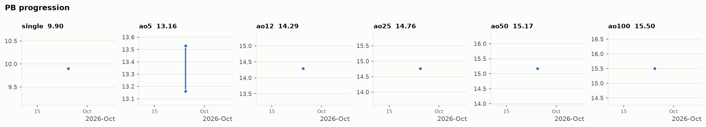

# 3x3 PBs

Personal-best averages, with the full solve list and stats behind each one. New here? [What's in this repo →](REPO_GUIDE.md)

## Current PBs

| Event | PB | Date | Stats |
|---|---|---|---|
| **single** | **9.90** | 2026-09-25 | [details](stats/single/single_2026-09-25.md) |
| **ao5** | **13.16** | 2026-09-25 (#2) | [details](stats/ao5/ao5_2026-09-25_2.md) |
| **ao12** | **14.29** | 2026-09-25 | [details](stats/ao12/ao12_2026-09-25.md) |
| **ao25** | **14.76** | 2026-09-25 | [details](stats/ao25/ao25_2026-09-25.md) |
| **ao50** | **15.17** | 2026-09-25 | [details](stats/ao50/ao50_2026-09-25.md) |
| **ao100** | **15.50** | 2026-09-25 | [details](stats/ao100/ao100_2026-09-25.md) |

**[Reconstructions →](reconstructions/README.md)** (1 solve)

## PB history

Newest first. Each new PB pushes the older ones down.

### single

| Date | Time | Improvement | σ | σ / mean | Stats |
|---|---|---|---|---|---|
| 2026-09-25 | **9.90** | first recorded | — | — | [details](stats/single/single_2026-09-25.md) |

### ao5

| Date | Time | Improvement | σ | σ / mean | Stats |
|---|---|---|---|---|---|
| 2026-09-25 (#2) | **13.16** | −0.37 | 2.19 | 15.9% | [details](stats/ao5/ao5_2026-09-25_2.md) |
| 2026-09-25 | 13.53 | first recorded | 1.04 | 7.7% | [details](stats/ao5/ao5_2026-09-25.md) |

### ao12

| Date | Time | Improvement | σ | σ / mean | Stats |
|---|---|---|---|---|---|
| 2026-09-25 | **14.29** | first recorded | 2.60 | 17.6% | [details](stats/ao12/ao12_2026-09-25.md) |

### ao25

| Date | Time | Improvement | σ | σ / mean | Stats |
|---|---|---|---|---|---|
| 2026-09-25 | **14.76** | first recorded | 2.84 | 18.8% | [details](stats/ao25/ao25_2026-09-25.md) |

### ao50

| Date | Time | Improvement | σ | σ / mean | Stats |
|---|---|---|---|---|---|
| 2026-09-25 | **15.17** | first recorded | 2.47 | 16.1% | [details](stats/ao50/ao50_2026-09-25.md) |

### ao100

| Date | Time | Improvement | σ | σ / mean | Stats |
|---|---|---|---|---|---|
| 2026-09-25 | **15.50** | first recorded | 2.47 | 15.8% | [details](stats/ao100/ao100_2026-09-25.md) |
