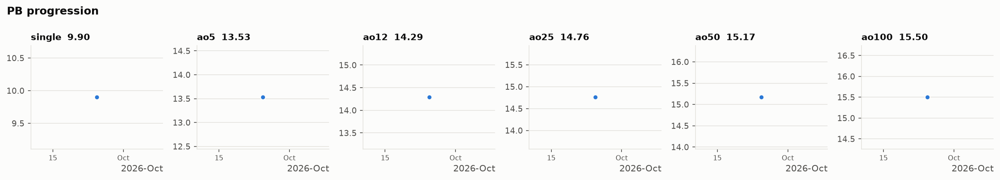

# 3x3 PBs

Personal-best averages, with the full solve list and stats behind each one.
Generated by `scripts/build.py` — don't edit this file by hand.

## Current PBs

| Event | PB | Date | Stats |
|---|---|---|---|
| **single** | **9.90** | 2026-09-25 | [details](stats/single/2026-09-25/README.md) |
| **ao5** | **13.53** | 2026-09-25 | [details](stats/ao5/2026-09-25/README.md) |
| **ao12** | **14.29** | 2026-09-25 | [details](stats/ao12/2026-09-25/README.md) |
| **ao25** | **14.76** | 2026-09-25 | [details](stats/ao25/2026-09-25/README.md) |
| **ao50** | **15.17** | 2026-09-25 | [details](stats/ao50/2026-09-25/README.md) |
| **ao100** | **15.50** | 2026-09-25 | [details](stats/ao100/2026-09-25/README.md) |

**[Fast solve bank →](fast-solves/README.md)** (0 solves)



## PB history

Newest first. Each new PB pushes the older ones down.

### single

| Date | Time | Improvement | σ | Recon | Stats |
|---|---|---|---|---|---|
| 2026-09-25 | **9.90** | first recorded | — |  | [details](stats/single/2026-09-25/README.md) |

### ao5

| Date | Time | Improvement | σ | Recon | Stats |
|---|---|---|---|---|---|
| 2026-09-25 | **13.53** | first recorded | 1.04 |  | [details](stats/ao5/2026-09-25/README.md) |

### ao12

| Date | Time | Improvement | σ | Recon | Stats |
|---|---|---|---|---|---|
| 2026-09-25 | **14.29** | first recorded | 2.60 |  | [details](stats/ao12/2026-09-25/README.md) |

### ao25

| Date | Time | Improvement | σ | Recon | Stats |
|---|---|---|---|---|---|
| 2026-09-25 | **14.76** | first recorded | 2.84 |  | [details](stats/ao25/2026-09-25/README.md) |

### ao50

| Date | Time | Improvement | σ | Recon | Stats |
|---|---|---|---|---|---|
| 2026-09-25 | **15.17** | first recorded | 2.47 |  | [details](stats/ao50/2026-09-25/README.md) |

### ao100

| Date | Time | Improvement | σ | Recon | Stats |
|---|---|---|---|---|---|
| 2026-09-25 | **15.50** | first recorded | 2.47 |  | [details](stats/ao100/2026-09-25/README.md) |

## Adding a new PB

1. Save the solves as `records/<event>/YYYY-MM-DD.txt` (`<event>` is `single`, `ao5`, `ao12`, `ao25`, `ao50` or `ao100`). A second PB of the same event on the same day is `YYYY-MM-DD_2.txt`, then `_3`, … Paste the csTimer export as-is — header and all.
2. Run `python3 scripts/build.py`.
3. `git add -A && git commit -m "ao5 PB 12.80" && git push`.

The new record goes to the top of its history and the README updates itself.

### Reconstructions (optional)

Put `>` lines directly under any numbered solve. `//` starts a comment:

```
1. 9.90   R2 B2 L2 F D2 B L2 F2 L2 F' D2 R2 L D' F' D U2 L D' F'
> z2 // inspection
> D R' F D' // cross
> U R U' R' // F2L 1
```

The details page then shows the move count, TPS, and an alg.cubing.net link that replays the solve.
