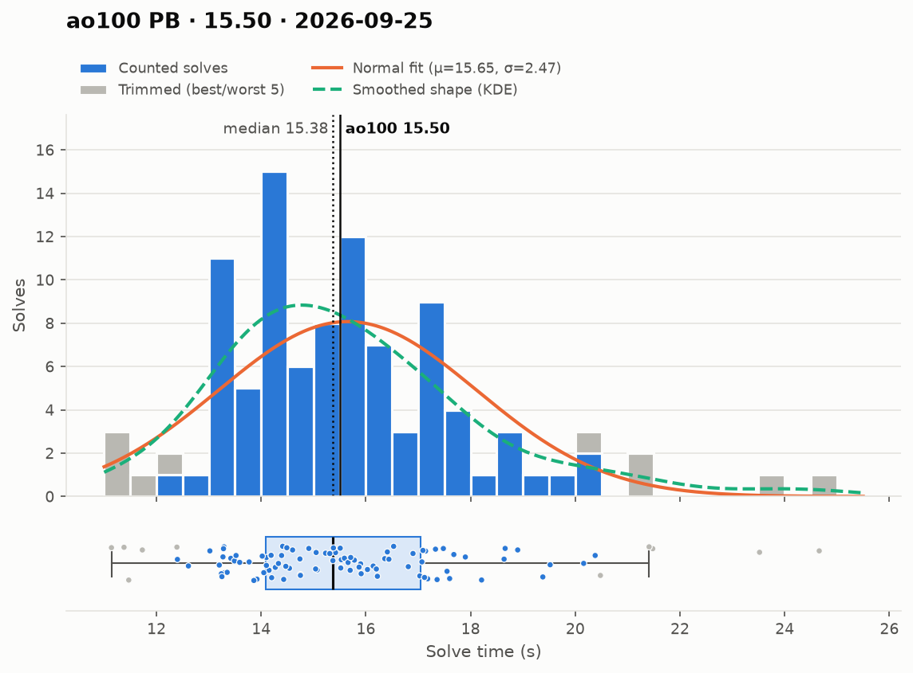
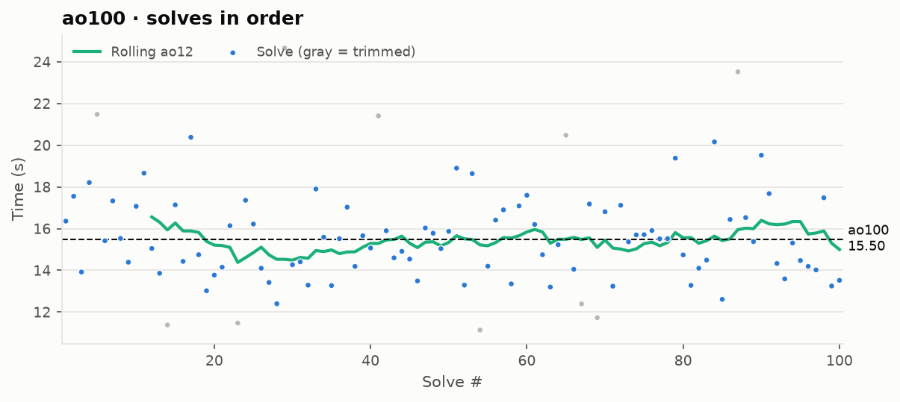

# ao100 PB — 15.50

**Date:** 2026-09-25  
[← all records](../../../README.md)

## Stats

| | |
|---|---|
| **ao100 (official, trimmed)** | **15.50** |
| Solves | 100 (trimmed 5 from each end) |
| Mean (all solves) | 15.65 |
| Median | 15.38 |
| Std dev (σ, all solves) | 2.47 |
| Std dev (σ, counted solves only) | 1.79 |
| Min / Best | 11.14 |
| Q1 (25th pct) | 14.09 |
| Q3 (75th pct) | 17.04 |
| Max / Worst | 24.66 |
| IQR (Q3 − Q1) | 2.95 |
| Range | 13.52 |
| Skewness | +1.08 |
| Shapiro–Wilk p (normality) | 0.000 |

**Sub-X counts:** sub-12: 4 · sub-13: 7 · sub-14: 23 · sub-15: 44 · sub-16: 64 · sub-17: 74

Skewness > 0 means a longer tail of slow solves (typical for cubing). Shapiro–Wilk p < 0.05 means the times are unlikely to be normally distributed.

## Distribution

## Solves in order

## Solves

| # | Time |
|---|---|
| 1 | **16.36** |
| 2 | **17.55** |
| 3 | **13.92** |
| 4 | **18.21** |
| 5 | (21.48+) |
| 6 | **15.42** |
| 7 | **17.33** |
| 8 | **15.53** |
| 9 | **14.39** |
| 10 | **17.07** |
| 11 | **18.66** |
| 12 | **15.05** |
| 13 | **13.86** |
| 14 | (11.38) |
| 15 | **17.14** |
| 16 | **14.43** |
| 17 | **20.38** |
| 18 | **14.75** |
| 19 | **13.02** |
| 20 | **13.77** |
| 21 | **14.15** |
| 22 | **16.14** |
| 23 | (11.47) |
| 24 | **17.36** |
| 25 | **16.22** |
| 26 | **14.10** |
| 27 | **13.42** |
| 28 | **12.40** |
| 29 | (24.66) |
| 30 | **14.27** |
| 31 | **14.41** |
| 32 | **13.29** |
| 33 | **17.90** |
| 34 | **15.59** |
| 35 | **13.27** |
| 36 | **15.52** |
| 37 | **17.03+** |
| 38 | **14.19** |
| 39 | **15.66** |
| 40 | **15.07** |
| 41 | (21.41) |
| 42 | **15.90** |
| 43 | **14.60** |
| 44 | **14.91** |
| 45 | **14.54** |
| 46 | **13.49** |
| 47 | **16.03+** |
| 48 | **15.78** |
| 49 | **15.04** |
| 50 | **15.87** |
| 51 | **18.90** |
| 52 | **13.29** |
| 53 | **18.64** |
| 54 | (11.14) |
| 55 | **14.20** |
| 56 | **16.41** |
| 57 | **16.90** |
| 58 | **13.35** |
| 59 | **17.09** |
| 60 | **17.60** |
| 61 | **16.20** |
| 62 | **14.75** |
| 63 | **13.20** |
| 64 | **15.23** |
| 65 | (20.48) |
| 66 | **14.05** |
| 67 | (12.39) |
| 68 | **17.18** |
| 69 | (11.73) |
| 70 | **16.81** |
| 71 | **13.24** |
| 72 | **17.12** |
| 73 | **15.37** |
| 74 | **15.70** |
| 75 | **15.71** |
| 76 | **15.91** |
| 77 | **15.51** |
| 78 | **15.52** |
| 79 | **19.38** |
| 80 | **14.74** |
| 81 | **13.28** |
| 82 | **14.10** |
| 83 | **14.49** |
| 84 | **20.16** |
| 85 | **12.61** |
| 86 | **16.44** |
| 87 | (23.52) |
| 88 | **16.53** |
| 89 | **15.38** |
| 90 | **19.52** |
| 91 | **17.68** |
| 92 | **14.33** |
| 93 | **13.59** |
| 94 | **15.31** |
| 95 | **14.47** |
| 96 | **14.19** |
| 97 | **14.02** |
| 98 | **17.48** |
| 99 | **13.25** |
| 100 | **13.52** |

Bold = counted, (parentheses) = trimmed. `+` = includes a +2 penalty.
