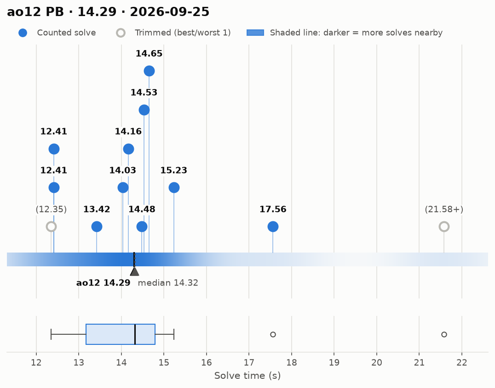
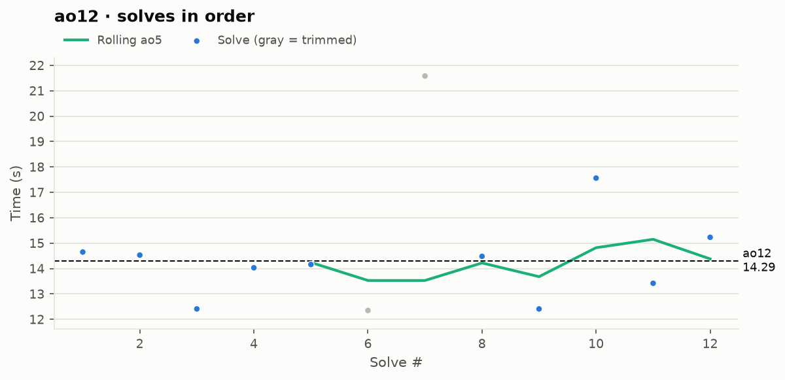

# ao12 PB — 14.29

**Date:** 2026-09-25  
[← all records](../../../README.md)

## Stats

| | |
|---|---|
| **ao12 (official, trimmed)** | **14.29** |
| Solves | 12 (trimmed 1 from each end) |
| Mean (all solves) | 14.73 |
| Median | 14.32 |
| Std dev (σ, all solves) | 2.60 |
| Std dev (σ, counted solves only) | 1.48 |
| **Consistency: σ / mean** | **17.6%** |
| Consistency, outlier-proof: IQR / median | 11.4% |
| Min / Best | 12.35 |
| Q1 (25th pct) | 13.17 |
| Q3 (75th pct) | 14.79 |
| Max / Worst | 21.58 |
| IQR (Q3 − Q1) | 1.63 |
| Range | 9.23 |
| Skewness | +1.88 |
| Shapiro–Wilk p (normality) | 0.008 |

**Sub-X counts:** sub-13: 3 · sub-14: 4 · sub-15: 9 · sub-16: 10 · sub-17: 10 · sub-18: 11

Skewness > 0 means a longer tail of slow solves (typical for cubing). Shapiro–Wilk p < 0.05 means the times are unlikely to be normally distributed.

## Distribution

## Solves in order

## Solves

| # | Time | Scramble |
|---|---|---|
| 1 | **14.65** | `F2 U2 L' F2 R' D2 U2 F2 R' B2 L F2 B' D2 F' D2 L F2 D B'` |
| 2 | **14.53** | `D' L' U2 B2 R' B2 F2 R B2 D2 L2 D2 R B L U L' U F' D2 B2` |
| 3 | **12.41** | `F2 U2 F2 R' U2 L B2 L2 B2 D2 R B2 D B F2 U' L2 U L U' B'` |
| 4 | **14.03** | `R' B' F2 D2 R' D2 L' B2 L2 B2 F2 U2 B2 F U2 B' D' U2 R B' L` |
| 5 | **14.16** | `L B U2 B' L2 R2 B D2 L2 R2 B U' B' L2 F D L' D L R` |
| 6 | (12.35) | `U' L F2 B' U' B2 U F D F2 D2 R' U2 F2 R L2 D2 L' D2 F2 R` |
| 7 | (21.58+) | `U B' F2 R F2 R2 F2 L' D2 F2 R2 F2 R B' U2 L' U R D' U' F'` |
| 8 | **14.48** | `L2 D2 R2 U2 B2 R B2 R' U2 L D2 R' U R B U2 B D' L D2 B'` |
| 9 | **12.41** | `D F2 U F2 R2 D2 B2 D2 B2 U F' D B2 L U R2 B U F' R` |
| 10 | **17.56** | `L2 R2 F2 U L2 R2 B2 U L2 D R2 L' U L F' U2 L' D2 R2` |
| 11 | **13.42** | `U' L2 F U B R L B L F2 L2 U2 B2 U' R2 L2 B2 U L2 B2` |
| 12 | **15.23** | `D' F2 D2 B R F' U F B2 U2 F2 R2 U D2 R2 U B2 D R2 B2` |

Bold = counted, (parentheses) = trimmed. `+` = includes a +2 penalty.
