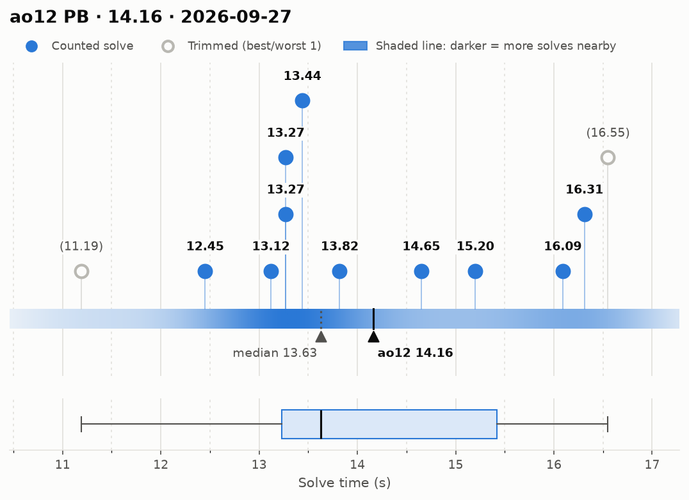
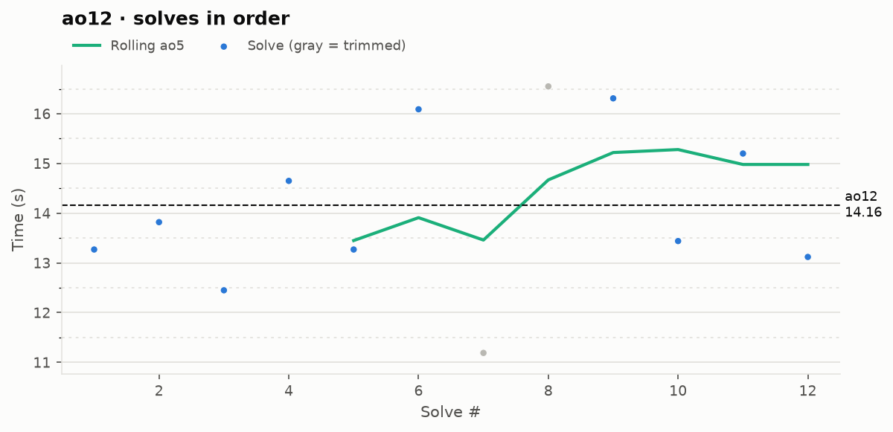

# ao12 PB — 14.16

**Date:** 2026-09-27  
**Previous PB:** 14.29 (2026-09-25) · improved by **0.13s**  
[← all records](../../README.md)

## Stats

| | |
|---|---|
| **ao12 (official, trimmed)** | **14.16** |
| Solves | 12 (trimmed 1 from each end) |
| Mean (all solves) | 14.11 |
| Median | 13.63 |
| Std dev (σ, all solves) | 1.66 |
| Std dev (σ, counted solves only) | 1.33 |
| **Consistency: σ / mean** | **11.8%** |
| Consistency, outlier-proof: IQR / median | 16.1% |
| Min / Best | 11.19 |
| Q1 (25th pct) | 13.23 |
| Q3 (75th pct) | 15.42 |
| Max / Worst | 16.55 |
| IQR (Q3 − Q1) | 2.19 |
| Range | 5.36 |
| Skewness | +0.05 |
| Shapiro–Wilk p (normality) | 0.567 |

**Sub-X counts:** sub-12: 1 · sub-13: 2 · sub-14: 7 · sub-15: 8 · sub-16: 9 · sub-17: 12

Skewness > 0 means a longer tail of slow solves (typical for cubing). Shapiro–Wilk p < 0.05 means the times are unlikely to be normally distributed.

## Distribution

## Solves in order

## Solves

| # | Time | Scramble |
|---|---|---|
| 1 | **13.27** | `D2 F2 D F2 L2 B2 U' B2 D' F2 L' F D R2 D' F D R' D2 U2` |
| 2 | **13.82** | `R2 D2 L2 B2 U' L2 D' R2 D' L' B2 D2 F L' D B R B' D'` |
| 3 | **12.45** | `F B' U' D2 R2 F2 R F' U F2 D' B2 R2 U2 B2 L2 D' R2 B'` |
| 4 | **14.65** | `U2 L' B U' B' D R F U2 D2 B D2 F' B' L2 D2 B2 D2 R' B2` |
| 5 | **13.27** | `B L2 B U' B L' U2 B2 U D2 F D2 B' L2 F' R2 B2 D2 F' R2 D2` |
| 6 | **16.09** | `R' F B2 L' D' B2 U' R F' L2 B' R2 D2 F' U2 F R2 F R2 L2 U'` |
| 7 | (11.19) | `R U D L B U F' D2 R2 F2 R D2 R D2 L' B2 U' R` |
| 8 | (16.55) | `D' L2 B2 L2 D F2 U L2 F2 R2 B D' R U L B F2 L' R2 D2` |
| 9 | **16.31** | `B L D' L' B2 R2 L' B' D R D2 L B2 U2 L' F2 D2 R U2 R U2` |
| 10 | **13.44** | `F L2 D2 L B' L' D2 F' L2 U' R2 U' F2 B2 U' F2 D' B2 U2 L` |
| 11 | **15.20** | `B2 U' B2 U' B2 D2 B2 R2 D2 R2 D2 F2 R' D2 U B U2 L U2 R' U2` |
| 12 | **13.12** | `D2 F' D2 U' L2 U2 F2 U R2 F2 L2 B2 R' U F2 U' B2 D R'` |

Bold = counted, (parentheses) = trimmed. `+` = includes a +2 penalty.
