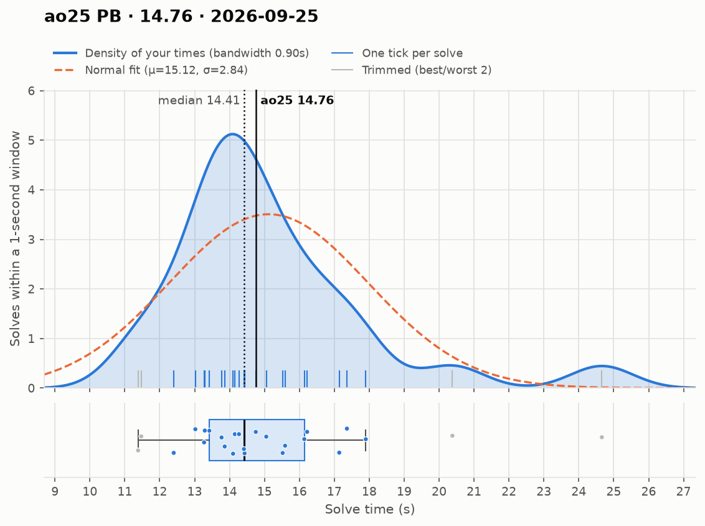
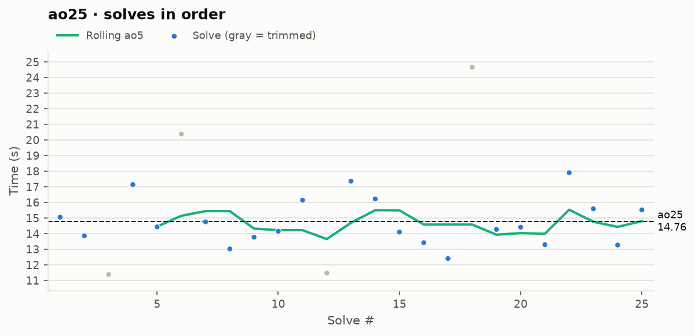

# ao25 PB — 14.76

**Date:** 2026-09-25  
[← all records](../../README.md)

## Stats

| | |
|---|---|
| **ao25 (official, trimmed)** | **14.76** |
| Solves | 25 (trimmed 2 from each end) |
| Mean (all solves) | 15.12 |
| Median | 14.41 |
| Std dev (σ, all solves) | 2.84 |
| Std dev (σ, counted solves only) | 1.51 |
| **Consistency: σ / mean** | **18.8%** |
| Consistency, outlier-proof: IQR / median | 18.9% |
| Min / Best | 11.38 |
| Q1 (25th pct) | 13.42 |
| Q3 (75th pct) | 16.14 |
| Max / Worst | 24.66 |
| IQR (Q3 − Q1) | 2.72 |
| Range | 13.28 |
| Skewness | +1.78 |
| Shapiro–Wilk p (normality) | 0.002 |

**Sub-X counts:** sub-12: 2 · sub-13: 3 · sub-14: 9 · sub-15: 15 · sub-16: 18 · sub-17: 20

Skewness > 0 means a longer tail of slow solves (typical for cubing). Shapiro–Wilk p < 0.05 means the times are unlikely to be normally distributed.

## Distribution

## Solves in order

## Solves

| # | Time |
|---|---|
| 1 | **15.05** |
| 2 | **13.86** |
| 3 | (11.38) |
| 4 | **17.14** |
| 5 | **14.43** |
| 6 | (20.38) |
| 7 | **14.75** |
| 8 | **13.02** |
| 9 | **13.77** |
| 10 | **14.15** |
| 11 | **16.14** |
| 12 | (11.47) |
| 13 | **17.36** |
| 14 | **16.22** |
| 15 | **14.10** |
| 16 | **13.42** |
| 17 | **12.40** |
| 18 | (24.66) |
| 19 | **14.27** |
| 20 | **14.41** |
| 21 | **13.29** |
| 22 | **17.90** |
| 23 | **15.59** |
| 24 | **13.27** |
| 25 | **15.52** |

Bold = counted, (parentheses) = trimmed. `+` = includes a +2 penalty.
