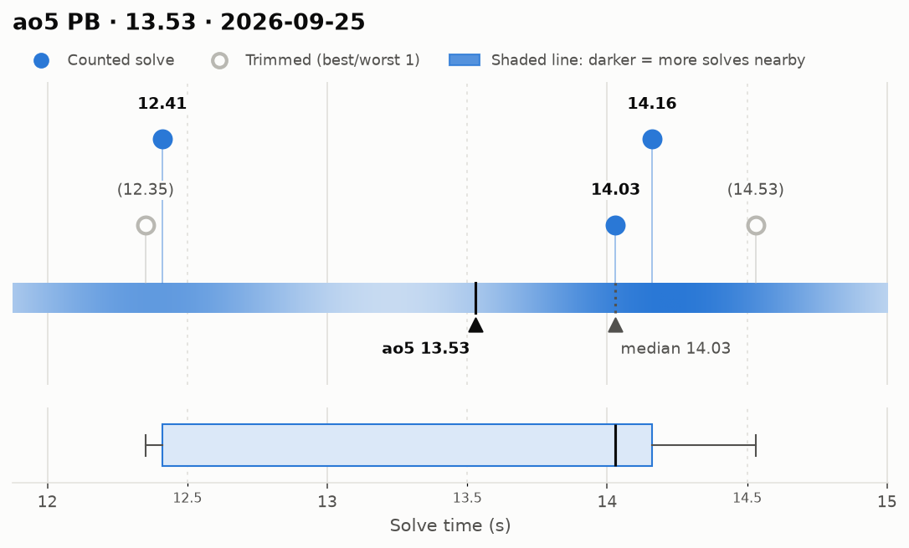
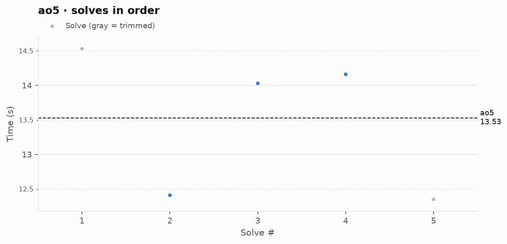

# ao5 PB — 13.53

**Date:** 2026-09-25  
[← all records](../../README.md)

## Stats

| | |
|---|---|
| **ao5 (official, trimmed)** | **13.53** |
| Solves | 5 (trimmed 1 from each end) |
| Mean (all solves) | 13.50 |
| Median | 14.03 |
| Std dev (σ, all solves) | 1.04 |
| Std dev (σ, counted solves only) | 0.98 |
| **Consistency: σ / mean** | **7.7%** |
| Consistency, outlier-proof: IQR / median | 12.5% |
| Min / Best | 12.35 |
| Q1 (25th pct) | 12.41 |
| Q3 (75th pct) | 14.16 |
| Max / Worst | 14.53 |
| IQR (Q3 − Q1) | 1.75 |
| Range | 2.18 |

**Sub-X counts:** sub-13: 2 · sub-14: 2 · sub-15: 5

## Distribution

## Solves in order

## Solves

| # | Time | Scramble |
|---|---|---|
| 1 | (14.53) | `D' L' U2 B2 R' B2 F2 R B2 D2 L2 D2 R B L U L' U F' D2 B2` |
| 2 | **12.41** | `F2 U2 F2 R' U2 L B2 L2 B2 D2 R B2 D B F2 U' L2 U L U' B'` |
| 3 | **14.03** | `R' B' F2 D2 R' D2 L' B2 L2 B2 F2 U2 B2 F U2 B' D' U2 R B' L` |
| 4 | **14.16** | `L B U2 B' L2 R2 B D2 L2 R2 B U' B' L2 F D L' D L R` |
| 5 | (12.35) | `U' L F2 B' U' B2 U F D F2 D2 R' U2 F2 R L2 D2 L' D2 F2 R` |

Bold = counted, (parentheses) = trimmed. `+` = includes a +2 penalty.
