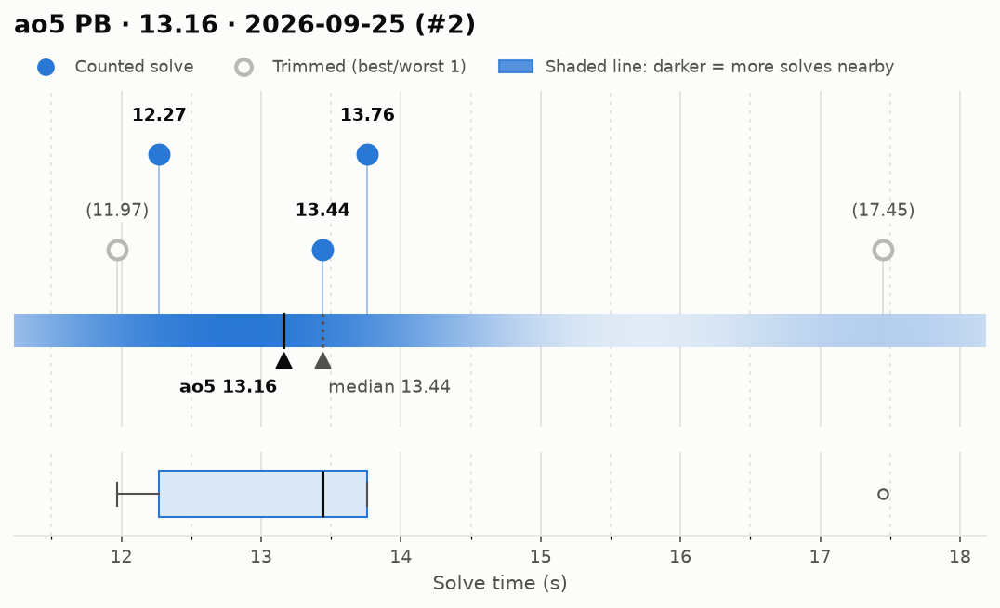
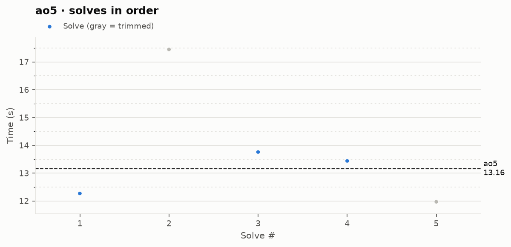

# ao5 PB — 13.16

**Date:** 2026-09-25 (#2)  
**Previous PB:** 13.53 (2026-09-25) · improved by **0.37s**  
[← all records](../../README.md)

## Stats

| | |
|---|---|
| **ao5 (official, trimmed)** | **13.16** |
| Solves | 5 (trimmed 1 from each end) |
| Mean (all solves) | 13.78 |
| Median | 13.44 |
| Std dev (σ, all solves) | 2.19 |
| Std dev (σ, counted solves only) | 0.78 |
| **Consistency: σ / mean** | **15.9%** |
| Consistency, outlier-proof: IQR / median | 11.1% |
| Min / Best | 11.97 |
| Q1 (25th pct) | 12.27 |
| Q3 (75th pct) | 13.76 |
| Max / Worst | 17.45 |
| IQR (Q3 − Q1) | 1.49 |
| Range | 5.48 |

**Sub-X counts:** sub-12: 1 · sub-13: 2 · sub-14: 4 · sub-15: 4 · sub-16: 4 · sub-17: 4

## Distribution



## Solves in order



## Reconstructions

### Solve 5 — 11.97

**Scramble:** `L2 R2 B' R2 F2 L2 D2 B' L2 F U2 L2 R' F' U R' B2 U2 R2 B F'`  
[▶ play on alg.cubing.net](https://alg.cubing.net/?setup=L2_R2_B-_R2_F2_L2_D2_B-_L2_F_U2_L2_R-_F-_U_R-_B2_U2_R2_B_F-&alg=x-_z_%2F%2F_inspection%0AR_U_x-_D_F_L2_D2_%2F%2F_cross%0AL-_U_L_y_U-_L_U_L-_%2F%2F_pair_1_%28green-orange%29%0AU2_L-_U-_L_R_U-_R-_%2F%2F_pair_2_%28blue-red%29%0AU-_L-_U_L_%2F%2F_pair_3_%28orange-blue%29%0AU-_R-_U_R-_F_R_F-_R_%2F%2F_pair_4_%28red-green%29%0A%28F_R_U_R-_U-_S_R_U_R-_U-_f-%29_%2F%2F_OLL%0AU_%28R-_U-_R_U_D-_R2_U_R-_U_R_U-_R_U-_R2_D%29_U2_%2F%2F_PLL_%28Gb%29&type=reconstruction)

| Moves (STM) | TPS | Rotations | ETM |
|---|---|---|---|
| **60** | **5.01** | 4 | 64 |

**Breakdown:** cross 6 · F2L total 32 (4 pairs, 6.5/pair) · last layer 28

```
x' z // inspection
R U x' D F L2 D2 // cross
L' U L y U' L U L' // pair 1 (green-orange)
U2 L' U' L R U' R' // pair 2 (blue-red)
U' L' U L // pair 3 (orange-blue)
U' R' U R' F R F' R // pair 4 (red-green)
(F R U R' U' S R U R' U' f') // OLL
U (R' U' R U D' R2 U R' U R U' R U' R2 D) U2 // PLL (Gb)
```

## Solves

| # | Time | Scramble |
|---|---|---|
| 1 | **12.27** | `F2 B2 L' F2 U' B' U' R D2 R' U2 B2 D2 R2 B2 L B2 R D' L2` |
| 2 | (17.45) | `F' U2 F' L2 B U2 B F L2 D2 R2 D2 R B D2 U2 B' D' L2 U` |
| 3 | **13.76** | `D' F' L2 B' L2 F' R2 B R2 F' D' B F2 L' B R D' F` |
| 4 | **13.44** | `R' F' D R L U' B' D L' F R2 B2 L2 D2 R2 L2 B' L2 F L2 F` |
| 5 | (11.97) | `L2 R2 B' R2 F2 L2 D2 B' L2 F U2 L2 R' F' U R' B2 U2 R2 B F'` |

<sub>Bold = counted, (parentheses) = trimmed. `+` = includes a +2 penalty.</sub>
