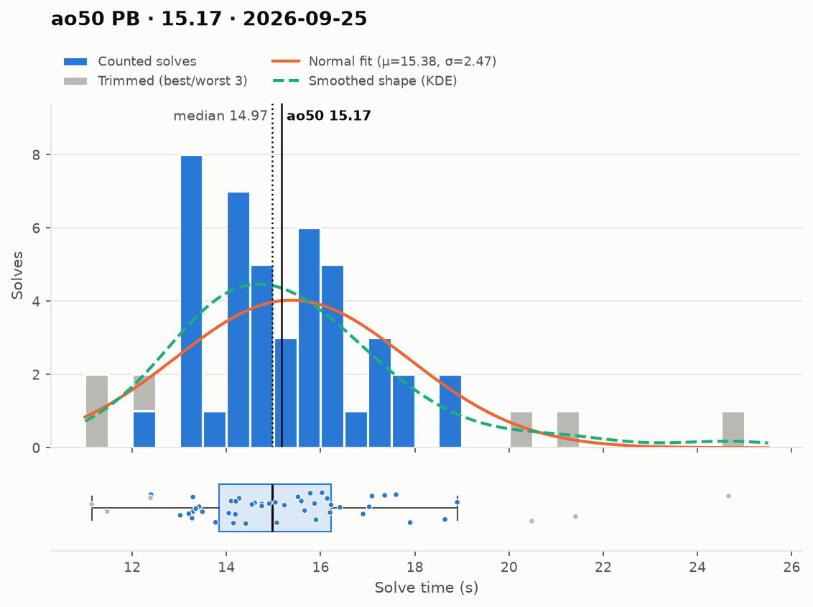
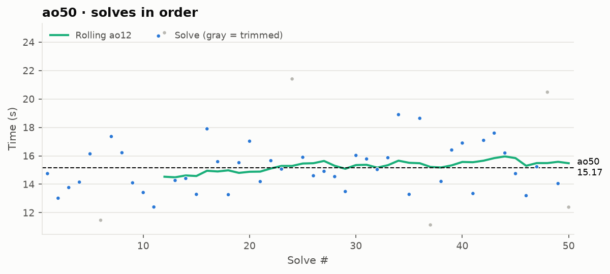

# ao50 PB — 15.17

**Date:** 2026-09-25  
[← all records](../../../README.md)

## Stats

| | |
|---|---|
| **ao50 (official, trimmed)** | **15.17** |
| Solves | 50 (trimmed 3 from each end) |
| Mean (all solves) | 15.38 |
| Median | 14.97 |
| Std dev (σ, all solves) | 2.47 |
| Std dev (σ, counted solves only) | 1.58 |
| **Consistency: σ / mean** | **16.1%** |
| Consistency, outlier-proof: IQR / median | 15.9% |
| Min / Best | 11.14 |
| Q1 (25th pct) | 13.84 |
| Q3 (75th pct) | 16.21 |
| Max / Worst | 24.66 |
| IQR (Q3 − Q1) | 2.38 |
| Range | 13.52 |
| Skewness | +1.40 |
| Shapiro–Wilk p (normality) | 0.001 |

**Sub-X counts:** sub-12: 2 · sub-13: 4 · sub-14: 13 · sub-15: 25 · sub-16: 34 · sub-17: 40

Skewness > 0 means a longer tail of slow solves (typical for cubing). Shapiro–Wilk p < 0.05 means the times are unlikely to be normally distributed.

## Distribution

## Solves in order

## Solves

| # | Time |
|---|---|
| 1 | **14.75** |
| 2 | **13.02** |
| 3 | **13.77** |
| 4 | **14.15** |
| 5 | **16.14** |
| 6 | (11.47) |
| 7 | **17.36** |
| 8 | **16.22** |
| 9 | **14.10** |
| 10 | **13.42** |
| 11 | **12.40** |
| 12 | (24.66) |
| 13 | **14.27** |
| 14 | **14.41** |
| 15 | **13.29** |
| 16 | **17.90** |
| 17 | **15.59** |
| 18 | **13.27** |
| 19 | **15.52** |
| 20 | **17.03+** |
| 21 | **14.19** |
| 22 | **15.66** |
| 23 | **15.07** |
| 24 | (21.41) |
| 25 | **15.90** |
| 26 | **14.60** |
| 27 | **14.91** |
| 28 | **14.54** |
| 29 | **13.49** |
| 30 | **16.03+** |
| 31 | **15.78** |
| 32 | **15.04** |
| 33 | **15.87** |
| 34 | **18.90** |
| 35 | **13.29** |
| 36 | **18.64** |
| 37 | (11.14) |
| 38 | **14.20** |
| 39 | **16.41** |
| 40 | **16.90** |
| 41 | **13.35** |
| 42 | **17.09** |
| 43 | **17.60** |
| 44 | **16.20** |
| 45 | **14.75** |
| 46 | **13.20** |
| 47 | **15.23** |
| 48 | (20.48) |
| 49 | **14.05** |
| 50 | (12.39) |

Bold = counted, (parentheses) = trimmed. `+` = includes a +2 penalty.
